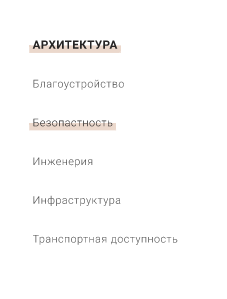
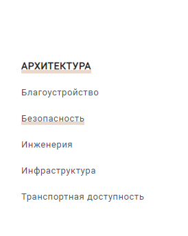
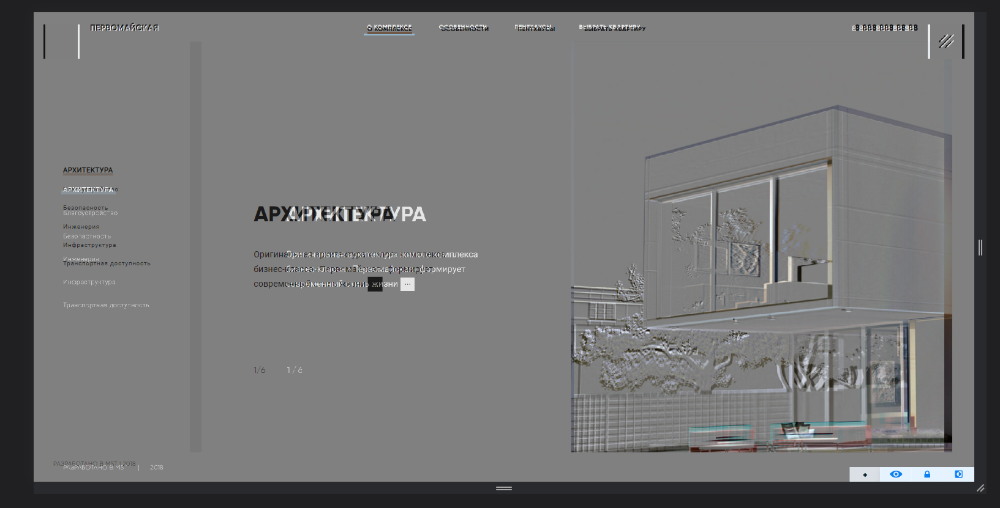
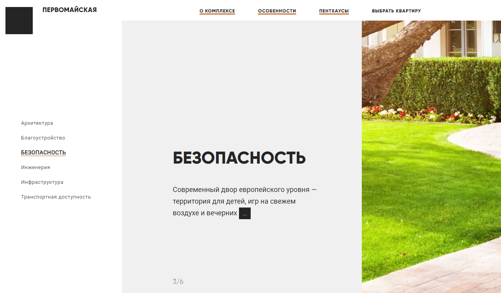

# Общие мысли и замечания

- По выданной информации не вижу задеплоенную версию  на Github Pages или Netlify, Surge
- Отсутсвиое README.md файла с описанием работы над тестовым заданием 

### Несоотвестие с макетом 
- на макете figma

- отображение в проекте

- И общие расхождения по макету(**теста, картинки**)

### Вообще в тестовом не было указано про pixel prefect, но в 90% случаях мы делаем по pixel perfect

- Неправильная логика отображения пунктов, да и 
вообще через отобржение без плавных анимаций, 
и выделаятся через margin, довольно странная практика,
и тем самам получаем что подчеркиваются не до пункта
по которому кликнули, а каждый отдельно

## Было бы круто

- Если была бы реализация на React или Vue, Nuxt, Next, так как почти 90% сайтов написаны на фреймворках
